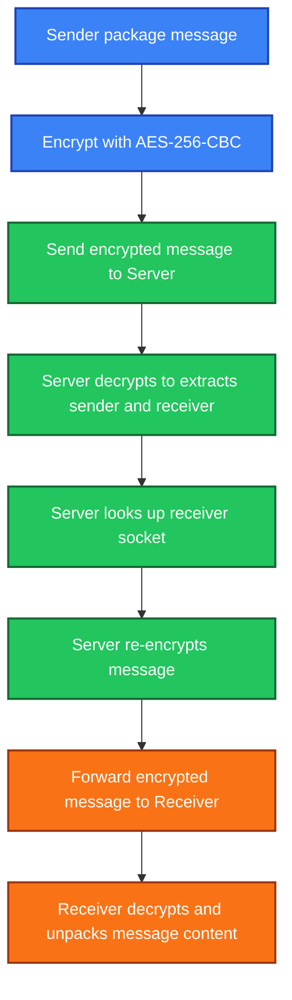

# Real-Time Chatroom


This is my **final project** for the *Computer Networks* course.

It is a simple **server–client application** built with **C++ socket programming**.
  
## 🧱 Project Structure

```sh
2024_CN_finalproject
├── /code/
│  ├── /data/  
│  │  ├── /client/       Client-side data storage for file transfer
│  │  └── /server/
│  │     └── account.csv Stores user account info for login checks
│  ├── /src/             Libraries used by other source files
│  │  ├── UI.cpp         Text-based UI design
│  │  ├── crypt.cpp      Encryption-related functions
│  │  ├── file.cpp       File transfer functions
│  │  └── audio.cpp      Audio streaming functions
│  ├── client.cpp        Client-side core logic
│  ├── client.hpp
│  ├── clientmain.cpp    Client entry point
│  ├── server.cpp        Server-side core logic
│  ├── server.hpp
│  ├── servermain.cpp    Server entry point
│  └── Makefile
├── .gitignore
├── LICENSE
└── README.md
```

## 🖥️ Requirements    

To run the program successfully, please check the following:  

### Operating System  

The project runs on **Unix-based systems** (Linux, macOS).  

For Windows, you can use **WSL** to simulate the environment.  

### Compiler  

The project is fully written in **C++**.  

Make sure your environment has **g++** installed:  
```sh
g++ --version
```
If not installed, run:  
```sh
sudo apt install g++
```
### Libraries  
Install the following libraries before compiling:  
```sh
sudo apt-get update
sudo apt-get install libsdl2-dev
sudo apt install openssl
```
  
Ensure your environment supports these header files:  
- `<bits/stdc++.h>`(commonly used C++ standard headers)
- `<fstream>`、`<sstream>`(file I/O) 
- `<sys/socket.h>`、`<netinet/in.h>`、`<arpa/inet.h>`(socket programming & networking)

## ⚙️ Usage  

Compile the program inside the code directory:
```sh
make
```
Run the server: 
```sh
./server.o <server port>  
```
Run the client:  
```sh
./client.o <server ip or server domain> <server port>
```
(You may enter either the server IP or domain; the program resolves domains automatically.)  

### Server Side
- The server enters listen mode after startup.

- It responds only to client requests (login, logout, account queries, etc.).

- The server does not initiate messages to clients.
### Client Side

- Make sure the server is running before starting the client.

- After a successful connection, the client enters the main menu. 


#### Account Registration  

Conditions for creating an account:
- No colons (`:`)
- No spaces
  
Registered accounts are stored in `./code/data/server/account.csv` on the server side.

#### Login  

- Enter option `1` on the main menu to log in.
- Login succeeds only if the account is already registered.
- After logging in, a folder will be created at:`./code/data/client/[Your username]/`

This folder is used for file transfers.  

The server also records active users with:  

```cpp
static unordered_map<string, int> name_to_fd
```

#### Logout

Press `2` in the main menu to log out.

#### Chatroom  

After logging in, you can enter the **chatroom**.


- Enter the username of the person you want to chat with.
- They must also type **your username** in their chatroom window.
- A chat session starts only if both sides:
  1. Are **online**
  2. Enter **each other’s usernames**
  3. Are **not in another conversation**

If successful, you’ll see:
  


If the other user is **offline**: 
  
  

If the other user is **busy** or not in chatroom:
  
  

After press `Enter`, it will ask you want to `leave` or `wait`
  


If you choose `leave`, you will go back to main menu. Otherwise, you will enter the waiting window.
  


When other user type your name, you can chat each other.  

#### Encryption  
All communications (except **audio streaming**) are secured with **AES encryption** from **OpenSSL**.
- **Encrypt text message**
```cpp
vector<unsigned char> encrypt(const string &plain_text, const unsigned char *key, const unsigned char *iv)
{
    EVP_CIPHER_CTX *ctx = EVP_CIPHER_CTX_new();
    if (!ctx)
    {
        cerr << "EVP_CIPHER_CTX_new failed" << endl;
        return {};
    }

    if (EVP_EncryptInit_ex(ctx, EVP_aes_256_cbc(), NULL, key, iv) != 1)
    {
        cerr << "EVP_EncryptInit_ex failed" << endl;
        EVP_CIPHER_CTX_free(ctx);
        return {};
    }

    int len = static_cast<int>(plain_text.size());
    int block_size = EVP_CIPHER_block_size(EVP_aes_256_cbc());
    int max_len = len + block_size;

    vector<unsigned char> cipher_text(max_len);
    int update_len = 0, final_len = 0;

    if (EVP_EncryptUpdate(ctx, cipher_text.data(), &update_len, reinterpret_cast<const unsigned char *>(plain_text.data()), len) != 1)
    {
        cerr << "EVP_EncryptUpdate failed" << endl;
        EVP_CIPHER_CTX_free(ctx);
        return {};
    }

    if (EVP_EncryptFinal_ex(ctx, cipher_text.data() + update_len, &final_len) != 1)
    {
        cerr << "EVP_EncryptFinal_ex failed" << endl;
        EVP_CIPHER_CTX_free(ctx);
        return {};
    }

    EVP_CIPHER_CTX_free(ctx);

    // 修正 vector 長度為加密後的實際長度
    cipher_text.resize(update_len + final_len);

    // cout << "Encrypted size: " << cipher_text.size() << endl;
    return cipher_text;
}
```
- **Decrypt text message**
```cpp
string decrypt(const vector<unsigned char> &origin_cipher_text, const unsigned char *key, const unsigned char *iv)
{

    if (origin_cipher_text.size() % 16 != 0)
    {
        cerr << "Cipher length is not a multiple of block size, decryption aborted." << endl;
        return {};
    }

    EVP_CIPHER_CTX *ctx = EVP_CIPHER_CTX_new();
    if (!ctx)
    {
        cerr << "Failed to create EVP_CIPHER_CTX" << endl;
        return {};
    }

    if (EVP_DecryptInit_ex(ctx, EVP_aes_256_cbc(), NULL, key, iv) != 1)
    {
        cerr << "EVP_DecryptInit_ex failed" << endl;
        EVP_CIPHER_CTX_free(ctx);
        return {};
    }

    int len = static_cast<int>(origin_cipher_text.size());
    int block_size = EVP_CIPHER_block_size(EVP_aes_256_cbc());
    int max_len = len + block_size;

    vector<unsigned char> plain_text(max_len, 0);
    int update_len = 0, final_len = 0;

    if (EVP_DecryptUpdate(ctx, plain_text.data(), &update_len, origin_cipher_text.data(), len) != 1)
    {
        cerr << "EVP_DecryptUpdate failed" << endl;
        EVP_CIPHER_CTX_free(ctx);
        return {};
    }

    if (EVP_DecryptFinal_ex(ctx, plain_text.data() + update_len, &final_len) != 1)
    {
        cerr << "EVP_DecryptFinal_ex failed" << endl;
        EVP_CIPHER_CTX_free(ctx);
        return {};
    }

    EVP_CIPHER_CTX_free(ctx);

    plain_text.resize(update_len + final_len);

    return string(plain_text.begin(), plain_text.end());
}
```
- **Encrypt file**
```cpp
vector<unsigned char> encrypt_file(const vector<unsigned char> &plain_text, const unsigned char *key, const unsigned char *iv)
{
    // 建立 Context
    EVP_CIPHER_CTX *ctx = EVP_CIPHER_CTX_new();
    if (!ctx)
    {
        cerr << "EVP_CIPHER_CTX_new failed" << endl;
        return {};
    }

    // 初始化加密：AES-256-CBC
    if (EVP_EncryptInit_ex(ctx, EVP_aes_256_cbc(), nullptr, key, iv) != 1)
    {
        cerr << "EVP_EncryptInit_ex failed" << endl;
        EVP_CIPHER_CTX_free(ctx);
        return {};
    }

    // 準備足夠的輸出空間：明文長度 + 區塊大小
    int len = static_cast<int>(plain_text.size());
    int block_size = EVP_CIPHER_block_size(EVP_aes_256_cbc());
    int max_len = len + block_size;

    vector<unsigned char> cipher_text(max_len);
    int update_len = 0, final_len = 0;

    // 加密 Update
    if (EVP_EncryptUpdate(ctx, cipher_text.data(), &update_len, plain_text.data(), len) != 1)
    {
        cerr << "EVP_EncryptUpdate failed" << endl;
        EVP_CIPHER_CTX_free(ctx);
        return {};
    }

    // 加密 Final
    if (EVP_EncryptFinal_ex(ctx, cipher_text.data() + update_len, &final_len) != 1)
    {
        cerr << "EVP_EncryptFinal_ex failed" << endl;
        EVP_CIPHER_CTX_free(ctx);
        return {};
    }

    // 釋放 Context
    EVP_CIPHER_CTX_free(ctx);

    // 根據實際加密長度縮小 cipher_text
    cipher_text.resize(update_len + final_len);

    return cipher_text;
}
```

- **Decrypt file**
```cpp
string decrypt(const vector<unsigned char> &origin_cipher_text, const unsigned char *key, const unsigned char *iv)
{

    if (origin_cipher_text.size() % 16 != 0)
    {
        cerr << "Cipher length is not a multiple of block size, decryption aborted." << endl;
        return {};
    }

    EVP_CIPHER_CTX *ctx = EVP_CIPHER_CTX_new();
    if (!ctx)
    {
        cerr << "Failed to create EVP_CIPHER_CTX" << endl;
        return {};
    }

    if (EVP_DecryptInit_ex(ctx, EVP_aes_256_cbc(), NULL, key, iv) != 1)
    {
        cerr << "EVP_DecryptInit_ex failed" << endl;
        EVP_CIPHER_CTX_free(ctx);
        return {};
    }

    int len = static_cast<int>(origin_cipher_text.size());
    int block_size = EVP_CIPHER_block_size(EVP_aes_256_cbc());
    int max_len = len + block_size;

    vector<unsigned char> plain_text(max_len, 0);
    int update_len = 0, final_len = 0;

    if (EVP_DecryptUpdate(ctx, plain_text.data(), &update_len, origin_cipher_text.data(), len) != 1)
    {
        cerr << "EVP_DecryptUpdate failed" << endl;
        EVP_CIPHER_CTX_free(ctx);
        return {};
    }

    if (EVP_DecryptFinal_ex(ctx, plain_text.data() + update_len, &final_len) != 1)
    {
        cerr << "EVP_DecryptFinal_ex failed" << endl;
        EVP_CIPHER_CTX_free(ctx);
        return {};
    }

    EVP_CIPHER_CTX_free(ctx);

    plain_text.resize(update_len + final_len);

    return string(plain_text.begin(), plain_text.end());
}
```

- **Generate AES key and AES iv**
```cpp
void generateAESKeyAndIV(unsigned char *key, unsigned char *iv)
{
    if (RAND_bytes(key, 32) != 1)
    {
        cerr << "Failed to generate AES key" << endl;
        exit(EXIT_FAILURE);
    }

    if (RAND_bytes(iv, 16) != 1)
    {
        cerr << "Failed to generate AES IV" << endl;
        exit(EXIT_FAILURE);
    }
}
```

#### Message Transmission
  
Simply type the message you want to send in the input field.  

Messages are transmitted securely between clients via the server using AES encryption.  

The process is as follows:  
1. **Sender**: Packages the message with metadata (`sender`, `receiver`, `message`).
2. **Sender**: Encypyt the packaged message using **AES-256-CBC**.
3. **Server**: Receives and decrypts the message to extract `sender` and `receiver`.
4. **Server**: Looks up the receiver's socket.
5. **Server**: Re-encrypts the message and forwards it to the receiver.
6. **Receiver**: Decrypts the message and unpacks the content.

**Message format:** `[Chatting][Message] sender:receiver:message`

🔗 Flowchart:


#### File Transfer   
1. Place the file in `./code/data/client/[Your username]/`
2. Send it with: `<file> [filename]`
3. The recipient receives it in: `./code/data/client/[Receiver's username]/`

#### Audio streaming  
Type `<audio streaming>` to start streaming.  

**Only the sender can terminate the session by pressing Enter.**  

#### Exit Chatroom 
Type `<exit>` to leave the chatroom.  

Both sides will be disconnected.　

## 🛠️ Contribution   

Please check [CONTRIBUTING.md](CONTRIBUTING.md) and [CODE_OF_CONDUCT.md](CODE_OF_CONDUCT.md) for contribution guidelines.    
  
Open new ideas or bug reports under [Issues](https://github.com/boyan1001/2024_CN_finalproject/issues).  

## 🪪 Lisence  
[MIT](LICENSE) © Hank Chen  
